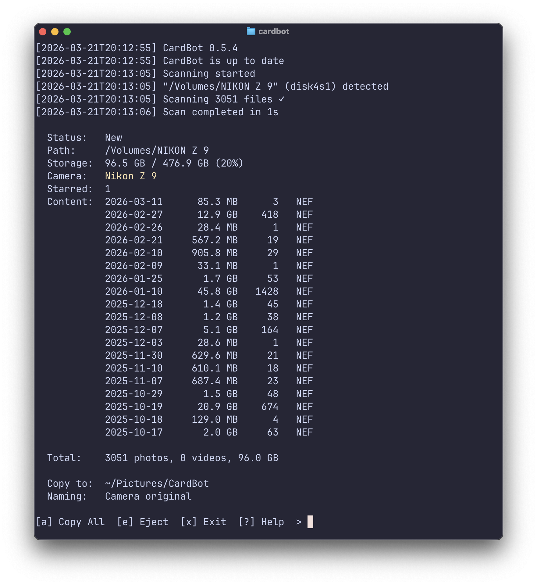

# CardBot

A CLI tool for camera memory cards.

 

## What CardBot does

- Detects camera memory cards on macOS
- Generates an overview of card content (file count, type, dates, equipment data, etc.) 
- Copy modes: all, selects (starred), photos only, videos only, etc
- Rename files during copy operations
- Tracks card copy status

## Platform Support

| Platform | Status | Notes |
|----------|--------|-------|
| macOS | Supported | Tested |
| Linux | I'm told it works | Untested |
| Windows | Ugh | Someday, Maybe Not |

## Installation

The easy install:

```bash
curl -fsSL https://raw.githubusercontent.com/willduncanphoto/CardBot/main/scripts/install.sh | sh
```

## Usage

Start CardBot:

```bash
cardbot
```

Quit CardBot:

`Ctrl+C`

CardBot will automatically run the setup if no config file is present.

Update to the latest version:

```bash
cardbot self-update
```


To run the setup again:

```bash
cardbot --setup
```


## Commands

| Key | Action |
|-----|--------|
| `a` | Copy all files to destination |
| `s` | Copy selects (starred/picked) |
| `p` | Copy photos only |
| `v` | Copy videos only |
| `t` | Copy today's photos |
| `y` | Copy yesterday's photos |
| `e` | Eject card |
| `x` | Exit current card |
| `i` | Show card hardware info |
| `\` | Cancel copy in progress |
| `?` | Help |


## Roadmap

| Version | Focus | Status |
|---------|-------|--------|
| **0.7.0** | Code Refactor | Complete |
| **0.8.0** | Card copy operations | Complete |
| **0.9.0** | Card copy part deux | Next |
| **0.10.0** | Copyright check and injection | Planned |


## Uninstalling

```bash
# Full uninstall (daemon + binary)
sh scripts/uninstall.sh --install-dir ~/bin

# Full uninstall + purge config + logs
sh scripts/uninstall.sh --install-dir ~/bin --purge
```

## License

MIT — see [LICENSE](LICENSE).
